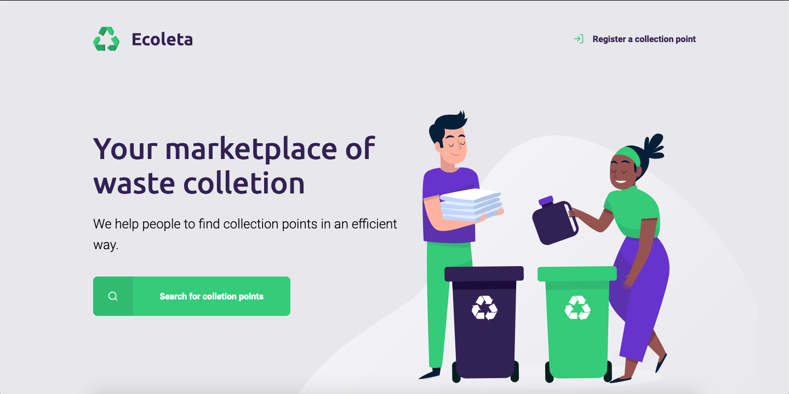
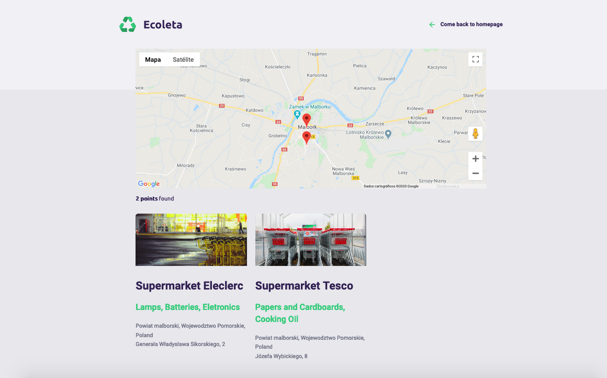
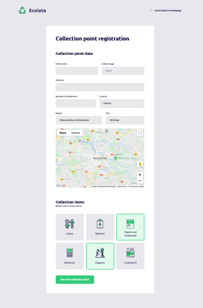

  

	
  
  
  
   
  
  

# 📖 About
This is a project that I developed basead in the course "NWL 1.0" made by [RocketSeat](rocketseat.com.br). The website has the purpose to help the users to find and/or to register collection points near them. 

I used this project as an opportunity to implement more technologies and try to improve it with more funcionalities, such as:
* Use [Google Maps API](https://developers.google.com/maps/documentation/javascript/overview) to allow the user to mark the location of the collection point when it's being registered, and show on the map all the collection points according to a determined city location
* Use the [Battuta API](http://battuta.medunes.net/) to determine the location of a collection point, by selecting specific the country, region and city where it can be found
* Use [SASS](https://sass-lang.com/) to write the CSS code and organize it

# 📐 Layout

  

    
  

  

    
  
 
  

    
  

### 🚀 Tecnologies
* Node.js(Express) - Backend
* [Nunjucks](https://mozilla.github.io/nunjucks/), SASS, HTML - Frontend
* SQLite - Database

# 🔧 How to run

To run this project, download it to your computer or use the git command `git clone`.

### Frontend

* Open the folder ecoleta/frontend
* Get a key of [Google Maps API](https://developers.google.com/maps/documentation/javascript/get-api-key)
* Open the file `src/pages/partials/scripts-map.html` and change in the link `KEY` by your Google Maps API key

### Backend

* Open the folder ecoleta/backend in your system's shell
* Run `$ npm install` to install the modules of this Node.js project
* Get a key at the website http://battuta.medunes.net/, to be able to use the Battuta API
* Rename the file `.env.example` to `.env`, open the file and add the Battua key to the environment variable `BATTUTA_KEY`
* Run `$ npm start` to start the backend server

# :closed_book: License

Released in 2020 :closed_book: License

This project is under the [MIT license](./LICENSE).

Give a ⭐️ if this project helped you!

#

   <b> &#60;/&#62; by <a href="https://www.linkedin.com/in/marco-echevestre/">Marco Echevestre</a></b>

